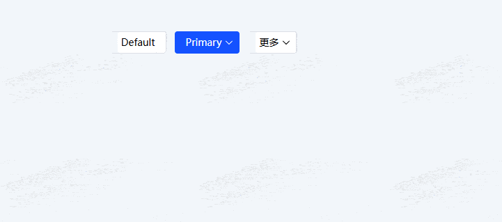

# VelMoreButtonGroup API文档

一个基于Element Plus开发的，更加易用的按钮组、下拉菜单

[英文](https://github.com/Planck-Ho/vel-more-button/blob/main/README.md) | **中文**

## 安装

```base
pnpm install vel-more-button
```

## 使用
```xml
<script setup lang="ts">
import { VelMoreButtonGroup, VelMoreButtonItem } from 'vel-more-button'
</script>

<template>
    <!-- 最多显示3个按钮，超过部分变为下拉菜单 -->
    <VelMoreButtonGroup :max="3">
        <VelMoreButtonItem content="Default" />
        <!-- 下拉菜单 -->
        <VelMoreButtonItem type="primary" content="Primary">
            <VelMoreButtonItem content="menu1" />
            <VelMoreButtonItem content="menu2">
                <VelMoreButtonItem content="menu2-1" />
                <VelMoreButtonItem content="menu2-2" />
            </VelMoreButtonItem>
            <VelMoreButtonItem content="menu3" />
        </VelMoreButtonItem>
        <VelMoreButtonItem type="success" content="Success" />
        <VelMoreButtonItem type="info" content="Info" />
        <VelMoreButtonItem type="warning" content="Warning" />
        <VelMoreButtonItem type="danger">
            <!-- 通过 content 插槽自定义渲染内容 -->
            <template #content>
                <span style="color: red;">Danger</span>
            </template>
        </VelMoreButtonItem>
    </VelMoreButtonGroup>
</template>
```



## VelMoreButtonGroup 属性

| 属性名 | 说明 | 类型 | 默认值 |
| - | - | - | - |
| max | 按钮最大显示数量，默认0通过容器宽度自动计算 | <code>number</code> | 0
| size | 尺寸	| 枚举：'large' 'default'  'small' | -
| text | 是否为文字按钮	| <code>boolean</code> | false
| link | 是否为链接按钮	| <code>boolean</code> | false
| more-text | 更多按钮文本	| <code>string</code> | 更多

## VelMoreButtonGroup 插槽
| 插槽名 | 说明 | 子标签
| - | - | -
| default | 自定义默认内容 | VelMoreButtonItem

## VelMoreButtonItem 属性

| 属性名 | 说明 | 类型 | 默认值 |
| - | - | - | - |
| content | 按钮内容 | <code>string</code> | -
| disabled | 是否禁用 | <code>boolean</code> | false
| - | 支持按钮配置其他属性参考 <a href="https://cn.element-plus.org/zh-CN/component/button.html#button-%E5%B1%9E%E6%80%A7" target="_blanck">el-button</a> | - | -
## VelMoreButtonItem Slots
| 插槽名 | 说明 | 子标签
| - | - | -
| default | 默认插槽，下拉菜单使用，只能放置VelMoreButtonItem | VelMoreButtonItem
| content | 按钮内容 | -